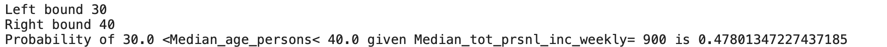

# victoria_stats

I want to run analysis to figure out the probability of a certain median age given a specific median personal income. To do this I use Australian Census data.

These results do not take into account sampling biases which the census data may have, this will not be discussed here as this repository is more of a demonstration, but is a very important part of data analysis. More information on the quality of this data can be found referenced at the bottom of this read me file (1). 

These results cannot be used to infer general statistics on the trends of age and income in Victoria; our results can only be used to interpret how median postcode age and median income interact. This is due to the fact I am calculating these statistics from already averaged statistics, which introduces a bias due to the undersampling of off-median ages (imbalanced data). To combat this I would like to have the full unaveraged data, but this is currently not avaliable. Knowing these caveats I continue with the problem at hand. 

Below is a visualisation of the median ages throughout victoria. I plot borders for each locality and fill in the area based on the data value associated with its postcode. Grey regions do not have a postcode associated with the locality while red regions represent where no data is present of the postcode. 

Metropolitan Victoria

Plot data for median age and median personal income per week.

Below is the model. I assume a bivariate normal and calculate the covaraince using the using the inner product of data. This is the joint distribution of N(age,income)

The conditional distribution (below) calculated from the joint distribution (above). This is a probability density function.

I then calculate the probabilities of age given income by integrating the area between my age range of interest. In the example below age is 30-40 for an income of 900.  

This comes out to; 

In the Australian Census data if a postcode has an income of 900 the probability of the median age being 30-40 is 47 percent. The median age is most likely to be 39 years old.

(1) CENSUS INDEPENDENT ASSURANCE PANEL TO THE AUSTRALIAN STATISTICIAN Report on the Quality of 2016 Census Data (https://www.abs.gov.au/websitedbs/d3310114.nsf/home/Independent+Assurance+Panel/%24File/CIAP+Report+on+the+quality+of+2016+Census+data.pdf)

Median Victorian age and person income data obtained from Australian census data (download from https://datapacks.censusdata.abs.gov.au/datapacks/ )

Victorian ESRI shape file downloaded from ( https://data.gov.au/data/dataset/af33dd8c-0534-4e18-9245-fc64440f742e )

Locality to Postcode key data from ( https://www.matthewproctor.com/full_australian_postcodes_vic )

