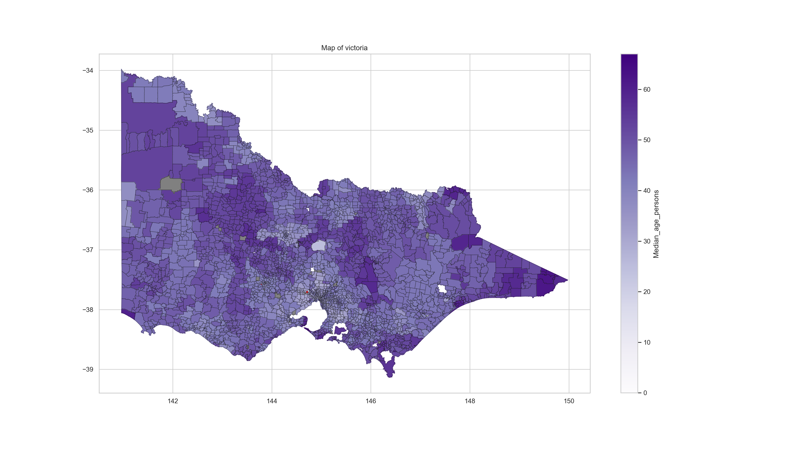
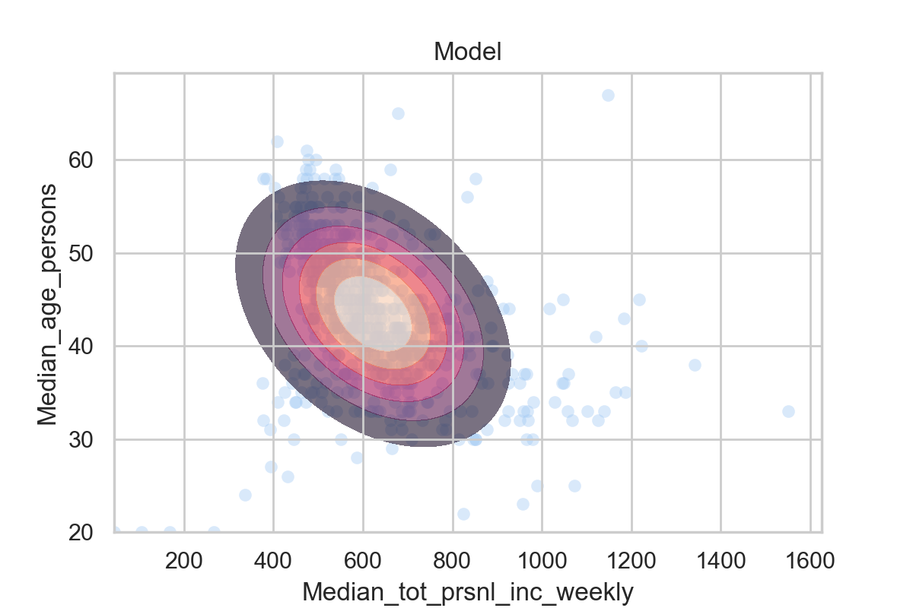

# victoria_stats
The code can be seen in 
The bottom is an image of Victoria with median age plotted. Median Victorian age data obtained from Australian census data (download from https://datapacks.censusdata.abs.gov.au/datapacks/ )

Victorian ESRI shape file downloaded from ( https://data.gov.au/data/dataset/af33dd8c-0534-4e18-9245-fc64440f742e )

Locality-Postcode key data from ( https://www.matthewproctor.com/full_australian_postcodes_vic )
Visualise the distribution of age throughout victoria.

Metropolitan Victoria

I want to run analysis to figure out the probability of a certain age of a person given a specific personal income.
Plot data for age and personal income per week.

This is the model, I assume a bivariate normal and I calculate the covaraince using the using the inner product of data. This is the joint distribution of N(age,income)

A plot of the conditional distribution calculated from the joint distribution. This is a probability density function.

I then calculate the probabilities of age given income by integrate the area between my set age range. In the example below age is 30-40.  

